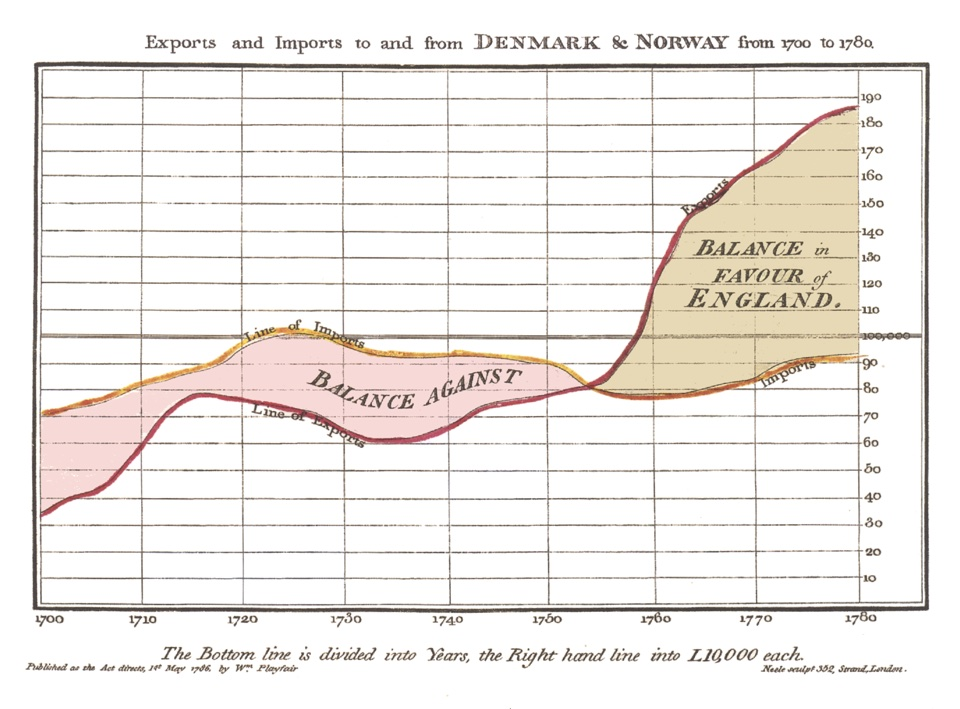

# Welcome!

***
[slides: bit.ly/cu-vis](http://bit.ly/cu-vis)

## Who I am:

Erik Cunningham

[@trinary](http://twitter.com/trinary)

[ http://github.com/trinary ](http://github.com/trinary)

## Topics

***

 * Why visualize
 * What to visualize
 * Working with D3.js
 * Where to learn more
##  Drawing Data

*** 

William Playfair "engineer, political economist and scoundrel", 1758

Note:
We've been doing this for a long time, and in its current form for 250ish years

## Visual Processing

*** 

Large parts of the human brain are involved in processing visual information.

We see trends, patterns, and outliers in images far faster than in raw data.

*** 

It also brings overfitting, bias, and other distortions.
## Spurious Correlation:

***

[This entire site](http://www.tylervigen.com/)
##  Intuitive Communication

***

Count the dimensions shown here:

Charles Minard, 1868

Note:
Considered by many to be the best visualization ever made.
## Dimensions

 * Position
 * Distance Traveled
 * Direction
 * Army Size
 * Temperature
 * Time
***

Hundreds of pieces of data in six dimensions, distilled into a single, understandable image.

*** 

> "The great growth of statistical research in our times has made felt the need to record the results in forms less dry, more useful, and able to be explored more rapidly than numbers alone."

Minard

### Less Dry

### More Useful

### Able to be explored rapidly
## Why not Numbers?

***

In 1973, Francis Anscombe constructed a dataset with four series. These four arrays of x/y pairs have:

 * The same mean in both X and Y
 * The same variance in both X and Y
 * A high coefficient of correlation 
 * The same regression line

***

These sets should be essentially the same, right?

### Nope!

## Engage Visual Processing

*** 

When we let the eye do its work, important characteristics of our data present themselves.

## Choosing a Display

***

Many criteria go into choosing a visualization:

 * structure of the data (nested/grouped?)
  * [Series](http://bl.ocks.org/mbostock/3884955), [Grouped](http://bl.ocks.org/mbostock/3943967), [Network](http://bl.ocks.org/mbostock/2706022), [Tree](http://bl.ocks.org/mbostock/999346)
 * amount of data (one observation vs millions)
  * [Single Values](http://bl.ocks.org/mbostock/4061961), [Focus](http://bl.ocks.org/mbostock/1667367)

## Advice

***

 * Start simple.
 * Only use "ink" to communicate information: [Tim Bray via Edward Tufte](http://www.tbray.org/ongoing/data-ink/di1)

*** 

A great deal can be accomplished with line and bar charts.
## Bussed Out

*** 

In December, The Guardian took a look at relocations of homeless people that many cities encourage.

Nadieh Bremer and Shirlie Wu added graphics using variety of data sets.

[What they made](https://www.theguardian.com/us-news/ng-interactive/2017/dec/20/bussed-out-america-moves-homeless-people-country-study)

##  D3

Data Driven Documents

***

Created by Mike Bostock

Builds off of work on Protovis at the Stanford Vis Group

Maps data to DOM (HTML, SVG)

Limited support for Canvas rendering targets, much improved in v4.

Note:
Initial release in 2011.
JQuery was released in 2006.
Backbone 0.1.0 2010.
## D3 is Big

*** 

Hundreds of [API](https://github.com/d3/d3/blob/master/API.md) functions in 25 subprojects

Mike Bostock's [examples page](http://bl.ocks.org/mbostock) has 988 curated examples.

There are lots of tricks and non-obvious patterns, a common complaint is that the learning curve is far too steep.

##  Chart Libraries

There are a **lot** of libraries for out-of-the box charts.

***
(https://github.com/sorrycc/awesome-javascript#data-visualization)

There are some very capable and flexible higher-level libraries. Check out Vega and Vega-Lite:
(https://vega.github.io/vega-lite/)

Sometimes that's all you need! Choose a nice one.
## Drawbacks

***

 * Learning curve
 * Performance with many objects
 * Sometimes SVG/HTML/CSS workarounds are required
 * Limited support for old browsers.

 Note:
 Workarounds: compound lines, draw ordering
# Fundamental D3 Concepts

***

 * Data Binding
 * Enter, Exit, and Update sections
 * Callbacks to set attributes and styles

Note:
Data binding - associating an array of data with an array of elements
Enter, exit: "what to do when the data and the document are out of sync"
Update: "What to do when data and document are in sync"
Function generators: builds a function for you from a configuration
Callbacks: how data-dependent attributes are set.
##  Data Binding

Given an array of data: 

    [0,1,2]

Bind it to an existing set of elements: 

    

    

    

Like this:

    d3.selectAll("div").data([0,1,2])

##  Enter

Given a data binding

    d3.select("body").selectAll("div").data([0,1,2])

Tell D3 what to do when there is no corresponding document element for a data element:

    <body></body>

 

    d3.select("body").selectAll("div").data([0,1,2]).enter().append("div");

"Inside the body tag, bind each element of [0,1,2] to a div, creating it inside body if it doesn't exist."
##  Exit

Given an existing data binding, with elements created via `enter()`

    s = d3.select("body").selectAll("div").data([0,1,2]);
    s.enter().append("div");

Tell D3 what to do when there's no data to be bound to an element:

    s.exit().remove();

"If there's no data for an existing element, `remove()` it."
## Callbacks

***

When setting attributes or styles on bound elements, you can supply a callback.

    myData = [{ size: 10}, {size: 2}];
    ...
    mySelection.attr("r", function(d,i) { return d.size; });

The bound data and its index in the data array get passed in.

The return value is gets set as the attribute value.

## Let's look at an example:

***

BlockBuilder is a live-coding environment for D3.

[http://blockbuilder.org/trinary/d5252820161c9b1ee340511c763583f3](http://blockbuilder.org/trinary/d5252820161c9b1ee340511c763583f3)

The x positions of the circles are determined by the value of each element in `data`
## Okay, but that's pretty boring

***

Yeah, you're right. Let's take a look at something more relevant.

A bar chart!

[http://blockbuilder.org/trinary/88d9c034bbae77cb6560e70533ceecc8](http://blockbuilder.org/trinary/88d9c034bbae77cb6560e70533ceecc8)

## Not quite right

***

SVG uses a (0,0) point at the upper left corner.

 * X increases to the right
 * Y increases to the bottom

***

For our bar chart to look right, we need to specify the y and height values with this in mind.

Let's take a look:
[http://blockbuilder.org/trinary/de7c1c7b2e7bf2fb435846f17cb94bab ](http://blockbuilder.org/trinary/de7c1c7b2e7bf2fb435846f17cb94bab)
## Building Blocks

***

These techniques are used with d3 primitives like:

 * scales and axes
 * line and shape generators
 * behaviors and layouts
 * event handlers and callbacks

***

They result in the beautiful, interactive vector displays you see in examples. The way the API gets used is more sophisticated, but these fundamentals are how they are implemented.

## The Real Thing

***

Here's what a bar chart looks like using more of D3's functionality.

 * Scales
 * Axes
 * Labels

 ***

 [http://blockbuilder.org/trinary/20e97593502dbfe35254ce3581c95eab](http://blockbuilder.org/trinary/20e97593502dbfe35254ce3581c95eab)
## An Exercise

***

Edit the working bar chart example:

 * Make the color of each bar reflect its value
 * Make the color of each bar reflect its position in the data array
   * Hint: scales can be used for more things than data values

***

If you already know how to do this, help the people near you.

[http://blockbuilder.org/trinary/20e97593502dbfe35254ce3581c95eab](http://blockbuilder.org/trinary/20e97593502dbfe35254ce3581c95eab)

## D3 and Frameworks
Libraries like D3 no longer exist in isolation.
***
 * React: data as props, re-select and call d3 render code in render(), do not use JSX
 * Or: replace enter-update-exit with React JSX rendering, d3 becomes a utility library
 * Hybrid frameworks: [Semiotic by Elijah Meeks](https://github.com/emeeks/semiotic)
   * Implements d3-aware containers as a react component library
## How to Learn More

***

 * Read [Tufte](http://www.amazon.com/Visual-Display-Quantitative-Information/dp/0961392142/ref=sr_1_3?s=books&ie=UTF8&qid=1428014303&sr=1-3), [Few](http://www.amazon.com/Now-You-See-Visualization-Quantitative/dp/0970601980/ref=sr_1_3?s=books&ie=UTF8&qid=1428014362&sr=1-3), [Cleveland](http://www.amazon.com/Elements-Graphing-Data-William-Cleveland/dp/0963488414/ref=sr_1_4?s=books&ie=UTF8&qid=1428014303&sr=1-4)
 * Search the [API Docs](http://github.com/mbostock/d3/wiki/API-Reference)
 * D3 Slack [Signup](https://d3-slackin.herokuapp.com/), SO tag, Google Group
 * [ dashingd3js.com ]( http://dashingd3js.com )
 * Ian's Mixtapes: [Youtube Playlist](http://www.youtube.com/playlist?list=PLI_sHchSmdCDLfLl5uTnsaRB54tDlRubK)
 * Examples! 
  * Mike Bostock's: [http://bl.ocks.org/mbostock](http://bl.ocks.org/mbostock)
  * Chris Viau's [http://christopheviau.com/d3list/gallery.html](http://christopheviau.com/d3list/gallery.html)
 * Scott Murray's Book and Tutorials: [book](http://alignedleft.com/work/d3-book), [tutorials](http://alignedleft.com/tutorials)
### Questions?

***

[ @trinary ]( https://twitter.com/trinary )

